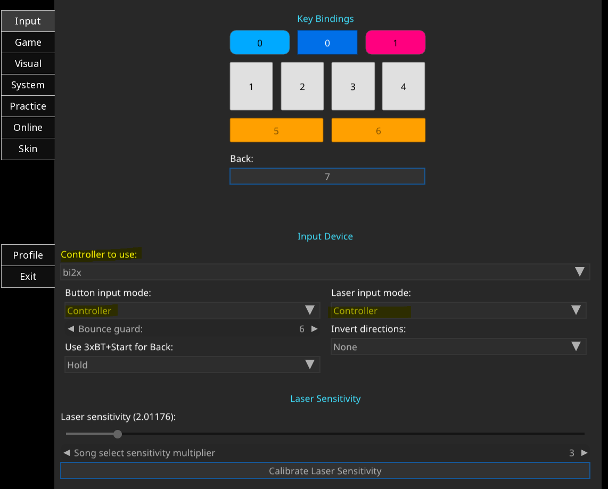
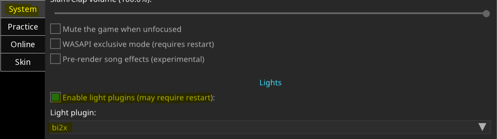

# bi2x-usc

Connects the cabinet's I/O board (7 buttons, 2 knobs, lights) to
[unnamed-sdvx-clone](https://github.com/Drewol/unnamed-sdvx-clone) (USC). Windows only. In use on
its cabinet, USC 0.6.0 (`2024-06-21_260b0505`).

The shim installs as an `SDL2.dll` next to the game. The board shows in the game as a joystick
named `bi2x`, and the shim also drives the outputs: button lamps, LED strips with the cabinet's own
lighting patterns, card reader LED. This page is the install and configuration guide; grab the
package from the [latest release](https://github.com/ouarss/bi2x-usc/releases/latest).

## Install

1. Download the [latest release](https://github.com/ouarss/bi2x-usc/releases/latest): one archive.
2. Close the game. Unzip into the game folder: it makes a `bi2x-usc` folder next to
   `usc-game.exe`. Run `bi2x-usc\deploy-with-light-support.bat` (controls + cabinet lights), or
   `bi2x-usc\deploy-controls-only.bat` for the controls alone.
3. In the game settings:
   - `Laser input mode` = Controller
   - `Button input mode` = Controller
   - device `bi2x`
   - Do NOT run the laser binding (the button binding is fine).
4. Lights only: Settings, System, Lights: check `Enable light plugins`, pick `bi2x`, restart.
5. After each game update: run the installer again. `deploy-with-light-support.bat /start` also
   launches the game.



Only for the lights (`deploy-with-light-support.bat` install):



## Manual install (without the .bat)

The installer only automates these steps, in the game folder (next to `usc-game.exe`):

1. Rename the game's own `SDL2.dll` to `SDL2_real.dll`. This rename is mandatory: with equal
   names, the shim would load itself without end. Do it once; a game update puts a fresh
   `SDL2.dll` back, so redo it after each update.
2. Copy `SDL2.dll` **from the archive** into the game folder (it takes the place of the renamed
   one).
3. Copy `bi2x.ini` from the archive next to it.
4. Lights only: copy `bi2x-light.dll` into the game's `LightPlugins` folder (create the folder if
   it does not exist).
5. Controls only, instead of step 4: skip the plugin, and set `enable_leds_strips = 0` and
   `enable_led_btns = 0` in the copied `bi2x.ini`.

Then configure the game as above. The shim finds the board's COM port on its own and remembers it
in `bi2x.port`, written next to the game.

## The map

- Buttons: START = 0, BT-A to BT-D = 1 to 4, FX-L = 5, FX-R = 6. The USC default map already
  fits: no binding needed.
- Lasers: axis 0 = left knob, axis 1 = right knob. `Controller_Laser0Axis` must stay 0 and
  `Controller_Laser1Axis` must stay 1: the in-game laser binding cannot detect the knobs and
  overwrites the correct default, so never run it.
- Button 7 = the SERVICE input = the game's Back (`Controller_Back = 7` in `Main.cfg`).

## Configuration: bi2x.ini

`bi2x.ini` sits next to the game and is read once at start. A missing key keeps its default: the
shim is tuned for the cabinet out of the box, so the file only carries what is yours to change.

| Key | Default | What it does |
|---|---|---|
| `back_input` | service | Which service-panel input is button 7 (the game's Back): `service`, `test`, `coin`, or `none`. |
| `enable_leds_strips` | 1 | The LED strips: the patterns, and the reader LED that travels with them. |
| `enable_led_btns` | 1 | The button lamps. Both switches at 0 = controls only. |
| `pattern_title` | title | The pattern of the USC title screen. Every `pattern_*` key takes one of the seven patterns below. |
| `pattern_menu` | menu | The pattern of the song wheel. |
| `pattern_idle` | menu | The pattern of every silent screen: results, dialogs, and everything when the light plugin is off. |
| `pattern_game_intro` | wipe | Played once when a song starts, for about a second. |
| `pattern_game` | game | The in-game pattern, restarted on the music's beat. |
| `brightness_title` .. `brightness_game` | absent | Brightness of one hook, percent (0..100). A missing key falls back to `led_default_brightness`. |
| `led_default_brightness` | 100 | Strip intensity, percent, for every hook without a `brightness_*` key. |
| `reader_title` .. `reader_game` | 1, 1, 1, 0, 0 | The card reader LED per hook: 1 follows the pattern's own breathing, 0 stays dark. |
| `btn_anim_title` .. `btn_anim_game` | title only | The button lamp show per hook: four chases in a loop. Pressed buttons stay lit on top. |
| `btn_anim_step_ms` | 125 | One step of the lamp show, in ms. |
| `trace` | 0 | Writes `bi2x.log` next to the game. Costs some performance: set it back to 0 after. |
| `lamp_probe` | 0 | Diagnostic: turns the strips off and tests the outputs one byte at a time, logged to `bi2x.log`. |

The seven patterns, rebuilt from the cabinet's own lighting:

| Name | Strips | Card reader LED |
|---|---|---|
| `off` | dark | dark |
| `boot` | the title pulse frozen at its first frame | breathing green |
| `title` | the pulse, white and cyan on the beat | breathing green |
| `wipe` | the rainbow wipe: one second, then dark | breathing cyan |
| `card` | the same pulse as `title` | breathing red |
| `menu` | the fade, two-second cycle | breathing cyan |
| `game` | the fade, quarter-second, beat-restarted | breathing cyan |

## Make your own animations

The `pattern_*`, `btn_anim_*` and `reader_*` keys take a built-in name, or the name of a `.json`
animation you make yourself. A visual editor runs in the browser, nothing to install:

**https://ouarss.github.io/bi2x-usc/**

Build an animation on the cabinet diagram — LED strips per zone (multi-stop gradients, per-keyframe
brightness), a button-lamp show, or the reader colour — preview it live, then download the `.json`.
Drop the file next to the game (the folder with `SDL2.dll`) and name it in `bi2x.ini`, without the
`.json`:

- `pattern_<hook> = <name>` for a strips animation
- `btn_anim_<hook> = <name>` for a lamp show
- `reader_<hook> = <name>` for the reader colour

Restart the game. The page is static and works offline; nothing is uploaded.

## After a game update

A game update restores the game's own `SDL2.dll` and stops the board: run the installer again.
Then check these keys in `Main.cfg`, with the game closed:

```
LaserInputDevice      = Controller
ButtonInputDevice     = Controller
Controller_DirectMode = True
Controller_Laser0Axis = 0         (left knob; the laser binding breaks this)
Controller_Laser1Axis = 1         (right knob)
UseLightPlugins       = True      (cabinet lights install)
LightPlugin           = "bi2x"
```

## Troubleshoot

Set `trace = 1` in `bi2x.ini`: the shim writes `bi2x.log` next to the game. Set it back to 0 after.
`bi2x.port` caches the COM port; delete it to force a new scan.

| Symptom | Check |
|---|---|
| No input | `bi2x.log` must show `board found on COMx`. |
| The game does not show the device | Is `SDL2_real.dll` the real library? Run the installer again. |
| The laser moves on its own | `Controller_DirectMode = True` is missing in `Main.cfg`. |
| No lamps, no strips | The two enable switches at 1 in `bi2x.ini`; `bi2x.log` must show `light plugin attached`. |
| Strips stay on idle in game | `UseLightPlugins = True`, `LightPlugin = "bi2x"` in `Main.cfg` (game closed). Same as the System settings, Lights section. |
| Lamps and reader dark, strips fine | The board needs a true power-up: cut mains AND usb together, power up, start again. The usb 5V keeps the board's logic alive through a mains cycle. |

## Licence

The released files are free to use (MIT, see [LICENSE](LICENSE)). No vendor code and no vendor
binary: the board's protocol was documented from its behaviour, on hardware that we own.
